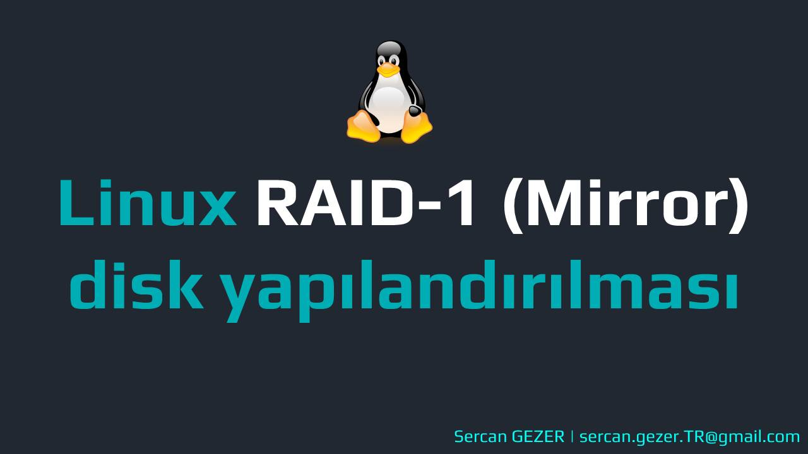

Esenlikler,

Bugün VirtualBox üzerinde oluşturduğumuz Rocky Linux üzerindeki disklerimizi `RAID-1 (Mirroring)` türünde biçimlendireceğiz. 

>RAID ile ilgili Türkçe olarak  [**RAID Nedir? RAID 0 - 1 - 5 - 6 - 10 Tipleri ve Farkları Nelerdir?**](https://kerteriz.net/raid-nedir-raid-tipleri-ve-seviyeleri-nelerdir/) yazısını okumanızı tavsiye ederim.

## Çalışma Ortamı

```bash
Sanallaştırma     :       VirtualBox
İşletim Sistemi   :       Rocky Linux 9.1
IP                            :       192.168.1.57
Hostname           :       raid-1.sercangezer.com
Disk 1 [5 GB]    :      /dev/sdb
Disk 2 [5 GB]    :      /dev/sdc
```

## Ön Hazırlık

* İşlemlerimizi `root` kullanıcısı ile yapıyoruz.
*  RAID yapımızı yönetmek için `mdadm` yazılımını kullanıyoruz.  Kurulum için;

```bash
[root@raid-1 ~]# yum install mdadm -y
```

* Disklerimizde herhangi bir RAID tanımlanması yapılmış mı diye kontrol edelim.

```bash
[root@raid-1 ~]# mdadm -E /dev/sd[b-c]
```

```bash
# Çıktı
mdadm: No md superblock detected on /dev/sdb.
mdadm: No md superblock detected on /dev/sdc.
```

##  Disklerimizi RAID için bölümlendirme
**Hızlıca diskimizi bölümlendirmek için;** (`/dev/sdb`)
```bash
[root@raid-1 ~]# fdisk /dev/sdb <<EOF
n
p
1


t
fd
w
EOF
```

**Hızlıca diskimizi bölümlendirmek için;** (`/dev/sdc`)
```bash
[root@raid-1 ~]# fdisk /dev/sdc <<EOF
n
p
1


t
fd
w
EOF
```

* Disklerimizin bölümlendiğini kontrol etmek için;

```bash
[root@raid-1 ~]# mdadm -E /dev/sd[b-c]


/dev/sdb:
   MBR Magic : aa55
Partition[0] :     41940992 sectors at         2048 (type fd)
/dev/sdc:
   MBR Magic : aa55
Partition[0] :     41940992 sectors at         2048 (type fd)
```

## RAID 1 cihazı oluşturma
* `/dev/sdb1` ve `/dev/sdc1` disk bölümlerini kullanarak `/dev/md0` RAID cihazımızı oluşturalım.

```bash
[root@raid-1 ~]# mdadm --create /dev/md0 --level=mirror --raid-devices=2 /dev/sd[b-c]1
```
**Çıktısı**
```bash
mdadm: Note: this array has metadata at the start and
    may not be suitable as a boot device.  If you plan to
    store '/boot' on this device please ensure that
    your boot-loader understands md/v1.x metadata, or use
    --metadata=0.90
Continue creating array? y
mdadm: Defaulting to version 1.2 metadata
mdadm: array /dev/md0 started.
``` 

* RAID oluşturma sürecini takip etmek için;

```bash
[root@raid-1 ~]# cat /proc/mdstat
```
**Çıktısı**
```bash
[root@raid-1 ~]#  cat /proc/mdstat
Personalities : [raid1]
md0 : active raid1 sdc1[1] sdb1[0]
      20953088 blocks super 1.2 [2/2] [UU]
      [=============>.......]  resync = 66.6% (13963776/20953088) finish=0.5min speed=206105K/sec

unused devices: <none>


[root@raid-1 ~]#  cat /proc/mdstat
Personalities : [raid1]
md0 : active raid1 sdc1[1] sdb1[0]
      20953088 blocks super 1.2 [2/2] [UU]

unused devices: <none>
```

* RAID'e eklenen disk bölümleri hakkında bilgi almak için;

```bash
[root@raid-1 ~]# mdadm -E /dev/sd[b-c]1
```

* Oluşturduğumuz RAID cihazına ait bilgileri görmek için;

```bash
[root@raid-1 ~]# mdadm --detail /dev/md0
```

## RAID cihazında dosya sistemi oluşturma
* `/dev/md0` RAID cihazını `ext4` formatında biçimlendiriyoruz.

```bash
[root@raid-1 ~]# mkfs.ext4 /dev/md0
```
**Çıktısı**
```bash
mke2fs 1.46.5 (30-Dec-2021)
/dev/md0 contains a ext4 file system
        created on Thu Apr 13 18:05:13 2023
Proceed anyway? (y,N) y
Creating filesystem with 5238272 4k blocks and 1310720 inodes
Filesystem UUID: b00be000-658c-4374-9918-94d3f15d383c
Superblock backups stored on blocks:
        32768, 98304, 163840, 229376, 294912, 819200, 884736, 1605632, 2654208,
        4096000

Allocating group tables: done
Writing inode tables: done
Creating journal (32768 blocks): done
Writing superblocks and filesystem accounting information: done

```

* Biçimlendirdiğimiz `/dev/md0` RAID cihazını `/raid-ornek` klasörüne bağlayalım.

```bash
[root@raid-1 ~]# mkdir /raid-ornek
[root@raid-1 ~]# mount /dev/md0 /raid-ornek/
```

* `df -hT ` ile baktığımızda cihazımızı başarıyla bağlandığını görüyoruz.

```bash
[root@raid-1 ~]# df -hT
Filesystem                           Type      Size  Used Avail Use% Mounted on
.
.
.
/dev/md0                             ext4       20G   24K   19G   1% /raid-ornek
.
.
```

20G boyutunda 2 tane disk bağlamamıza rağmen RAID-1 (Mirroring) yaptığımız için tek disk gibi 20G görünüyor.

* Sistem yeniden başladığında otomatik olarak bağlanabilmesi için `/etc/fstab` dosyasına eklememiz gerekiyor.

```bash
cat << EOF >> /etc/fstab
/dev/md0                /raid-ornek             ext4    defaults        0 0
EOF
```

* Otomatik bağlandığını (mount) kontrol edelim.

```bash
[root@raid-1 ~]# mount -av
.
.
.
/raid-ornek              : already mounted
```

* Son olarak `/etc/mdadm.conf` dosyasına RAID konfigürasyonunu yazdırıyoruz.

```bash
[root@raid-1 ~]# mdadm --detail --scan --verbose >> /etc/mdadm.conf

[root@raid-1 ~]# cat /etc/mdadm.conf
ARRAY /dev/md/0 level=raid1 num-devices=2 metadata=1.2 name=raid-1.sercangezer.com:0 UUID=afbe95f1:9f76348b:004230dd:a9f6dc25
   devices=/dev/sdb1,/dev/sdc1
```

* Artık RAID-1 cihazımız ile ilgili bilgi almak ve ya hata kontrolü yapmak için;

```bash
[root@raid-1 ~]# mdadm --detail /dev/md0

/dev/md0:
           Version : 1.2
     Creation Time : Thu Apr 13 17:52:28 2023
        Raid Level : raid1
        Array Size : 20953088 (19.98 GiB 21.46 GB)
     Used Dev Size : 20953088 (19.98 GiB 21.46 GB)
      Raid Devices : 2
     Total Devices : 2
       Persistence : Superblock is persistent

       Update Time : Fri Apr 14 12:06:23 2023
             State : clean
    Active Devices : 2
   Working Devices : 2
    Failed Devices : 0
     Spare Devices : 0

Consistency Policy : resync

              Name : raid-1.sercangezer.com:0  (local to host raid-1.sercangezer.com)
              UUID : afbe95f1:9f76348b:004230dd:a9f6dc25
            Events : 17

    Number   Major   Minor   RaidDevice State
       0       8       17        0      active sync   /dev/sdb1
       1       8       33        1      active sync   /dev/sdc1
```

## Video

<div align="center">
<iframe width="853" height="505" src="https://www.youtube.com/embed/cwqdlaQSEWw" title="YouTube video player" frameborder="0" allow="accelerometer; autoplay; clipboard-write; encrypted-media; gyroscope; picture-in-picture; web-share" allowfullscreen></iframe></div>