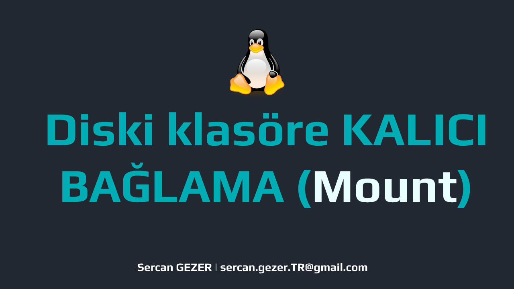

## Video

<div align="center">
<iframe class="youtube-video"  src="https://www.youtube.com/embed/1JvNOPDkFFE" title="YouTube video player" frameborder="0" allow="accelerometer; autoplay; clipboard-write; encrypted-media; gyroscope; picture-in-picture; web-share" allowfullscreen></iframe>
</div>

Esenlikler,

Linux sunucularımıza yeni disk eklediğimizde bunu sunucularımıza tanıtıp, ulaşabileceğimiz bir klasöre kalıcı olarak bağlamamız gerekiyor.

## Çalışma ortamı

🔥 VirtualBox üzerinde Vagrant ile otomatik kurulum için [**Vagrantfile**](https://gist.github.com/sercangezer/b7316008a0b9bc9974e311660a828dd2#file-vagrantfile)

``` bash
Sanallaştırma           :       VirtualBox
İşletim Sistemi         :       Centos7
IP                                  :       192.168.56.35
Hostname                 :       sercangezer-diskEkleme
Disk 1 [5 GB]             :       /dev/sdb
Disk 2 [8 GB]             :       /dev/sdc
``` 

## Ön Hazırlık

* İşlemlerimizi `root` kullanıcısı ile gerçekleştireceğiz.

##  Disklerimizi bölümlendirelim

* Bölümlendireceğimiz disklerin adlarını öğrenelim. 

```bash
root@sercangezer-diskEkleme:/root #> lsblk -paf
NAME                                 FSTYPE         LABEL UUID                                                                 MOUNTPOINT
/dev/sda                                                      
└─/dev/sda1                     xfs                 1c419d6c-5064-4a2b-953c-05b2c67edb15              /
/dev/sdb                                                      
/dev/sdc  
``` 

Bizim çalışmamızda `/dev/sdb` ve `/dev/sdc` diskleri.

*  Genelde disklerimizi    `ext4` ve ya  `xfs` dosya türünde biçimlendirmeyi tercih ediyoruz. Tamamen ihtiyaçlar doğrultusunda bir seçim.  Bu çalışmamızda `xfs` olarak biçimlendireceğim.

* Hızlıca diskimizi bölünmendirmek için aşağıdaki kodu çalıştıralım.

### /dev/sdb bölümlendirelim
```bash
root@sercangezer-diskEkleme:/root #> fdisk /dev/sdb <<EOF
n
p
1


w
EOF
```

### /dev/sdc bölümlendirelim
```bash
root@sercangezer-diskEkleme:/root #> fdisk /dev/sdc <<EOF
n
p
1


w
EOF
```

* Bölümlendirme yaptıktan sonraki son durum;

``` bash
root@sercangezer-diskEkleme:/root #> lsblk -paf
NAME                                          FSTYPE                                    LABEL UUID                                                                   MOUNTPOINT
/dev/sda                                                      
└─/dev/sda1                             xfs                                             1c419d6c-5064-4a2b-953c-05b2c67edb15                  /
/dev/sdb                                                      
└─/dev/sdb1                                                   
/dev/sdc                                                      
└─/dev/sdc1
```

Gördüğünüz gibi artık elimizde `/dev/sdb1` ve `/dev/sdc1` adında disk bölümlerimiz oluştu.

## Disk bölümlerimizi 'xfs' türünde biçimlendirelim

Disklerimizi Linux sistemimize tanıttık fakat hangi verinin nerede tutulduğunu ve istediğimiz zaman erişebilmemiz için bu disklerimizi `xfs` dosya sistemi türünde biçimlendirmemiz gerekiyor.

### /dev/sdb1 biçimlendirelim

``` bash
root@sercangezer-diskEkleme:/root #> mkfs.xfs /dev/sdb1
``` 

### /dev/sdc1 biçimlendirelim

``` bash
root@sercangezer-diskEkleme:/root #> mkfs.xfs /dev/sdc1
``` 

* `xfs` türünde biçimlendirdiğimizi teyit etmek için;

``` bash
root@sercangezer-diskEkleme:/root #> lsblk -apf
NAME                              FSTYPE              LABEL UUID                                                                          MOUNTPOINT
/dev/sda                                                      
└─/dev/sda1                 xfs                       1c419d6c-5064-4a2b-953c-05b2c67edb15                        /
/dev/sdb                                                      
└─/dev/sdb1                 xfs                        cb6d96bb-fbda-473f-ad68-5d8f1eb298ba 
/dev/sdc                                                      
└─/dev/sdc1                 xfs                         cfc34bde-85e2-435c-a89c-8b525bf95574
``` 

Görüldüğü gibi `/dev/sdb1` ve `/dev/sdc1` bölümlerinin FSTYPE ı `xfs` olarak görülüyor.

## Klasörlere bağlama

Disklerimize kolaylıkla ulaşabilmek için klasörlere bağlamalıyız.  Bizim örneğimizde **/mnt** klasörü altındaki **my-data** ve **my-linux** klasörlerine bağlayacağız.

``` bash
root@sercangezer-diskEkleme #> mkdir -p /mnt/my-data

root@sercangezer-diskEkleme #> mkdir -p /mnt/my-linux
``` 

* Oluşturdurduğumuz klasörlere `mount` komutuyla disklerimizi bağlıyoruz.

``` bash
root@sercangezer-diskEkleme #> mount /dev/sdb1 /mnt/my-data/

root@sercangezer-diskEkleme #> mount /dev/sdc1 /mnt/my-linux/
```

* Kontrol ettiğimizde bağlandığını görebiliyoruz.

``` bash
root@sercangezer-diskEkleme:/mnt #> df -hT

Filesystem     Type      Size  Used Avail Use% Mounted on
.
.
/dev/sdb1      xfs       5.0G   33M  5.0G   1% /mnt/my-data
/dev/sdc1      xfs       8.0G   33M  8.0G   1% /mnt/my-linux
``` 

❗Fakat bu kalıcı bir bağlama olmadı. Sunucuyu yeniden başlattığımızda bu bağlantının koptuğunu göreceksiniz. 

## KALICI olarak klasöre bağlama

Klasöre kalıcı olarak bağladığımızda  `mount -av` çıktısında gelmesi gerekiyor.

``` bash
root@sercangezer-diskEkleme:/mnt #> mount -av
/                        : ignored
none                     : ignored
```

Kalıcı hale getirmek için `/etc/fstab` dosyanın içerisine bağlama bilgilerini yazmamız gerekiyor.

İsterseniz **vi/nano** text editör ile `/etc/fstab` dosyasını açıp aşağıdaki tanımlamaları ekleyebilirsiniz.

``` text
/dev/sdb1         /mnt/my-data          xfs           defaults          0 0
/dev/sdc1         /mnt/my-linux          xfs           defaults          0 0

``` 
Direkt olarak **/etc/fstab** dosyasının sonuna eklemek için;

``` bash
echo '/dev/sdb1         /mnt/my-data          xfs           defaults          0 0' >> /etc/fstab
echo '/dev/sdc1         /mnt/my-linux          xfs           defaults          0 0' >> /etc/fstab
```

Artık `mount -av` ile kontrol ettiğimizde kalıcı olarak bağlandığını görebileceğiz.

``` bash
root@sercangezer-diskEkleme:/mnt #> mount -av

/                        : ignored
none                     : ignored
/mnt/my-data             : already mounted
/mnt/my-linux            : already mounted
``` 