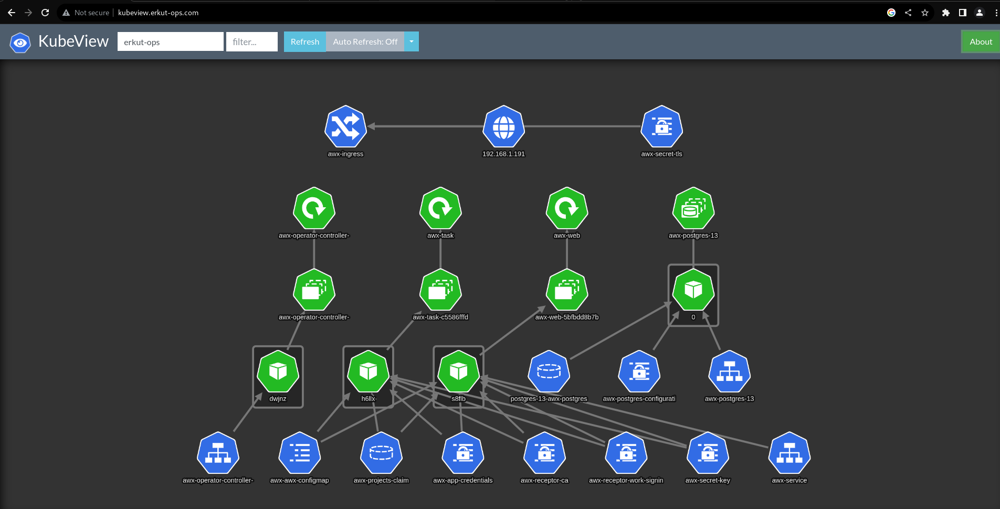

Esenlikler,

Yeni bir kubernetes ortamında çalışmaya başladığınızda ilk etapta objelerin birbiriyle ilişkilerini kurmakta zorlanırız. Bunu bir nebze azaltabilmek için [`kubeview`](https://github.com/benc-uk/kubeview) kullanarak görselleştirme yapabiliriz..

Kubeview in görselleştirebildiği objeler;

- Deployments
- ReplicaSets / StatefulSets / DaemonSets
- Pods
- Services
- Ingresses
- LoadBalancer IPs
- PersistentVolumeClaims
- Secrets
- ConfigMaps

Kuruluma geçelim...

* Repoyu indirelim.

```bash
git clone https://github.com/benc-uk/kubeview
```

* Chart dizinine gidelim.

```bash
cd kubeview/charts/
```

* `kubeview/values.yaml` dosyası içinden **ingress** ve ya **nodeport** tanımlayabilirsiniz.

* helm chart ı yükleyelim.

```bash
helm install kubeview ./kubeview -f myvalues.yaml
```

Örnek bir ekran

