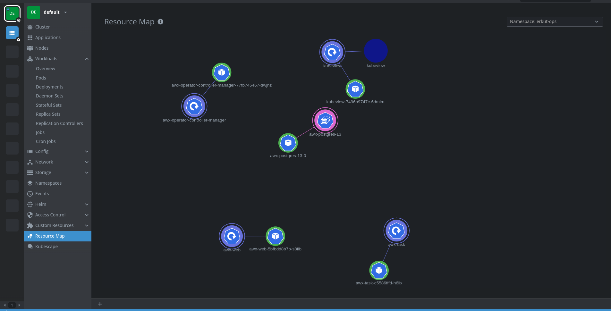

Esenlikler,

Kubernetes cluster yönetimini `kubectl` gibi native araçlar ile yapabileceğimiz gibi [`Lens`](https://k8slens.dev/) gibi GUI si olan araçlarda yönetimi kolaylaştırabiliyor.

Lens uygulamasının kubernetes objelerinin ilişkilerini görselleştiren [`Lens Resource Map`](https://github.com/nevalla/lens-resource-map-extension) eklentisini kuracağız.

Kuruluma geçelim ...

* Lens uygulamasını açalım.
* Sol üst menüden File > Extensions kısmına tıklayarak, açılan ekranda aşağıdaki URL'i girelim.

```
@nevalla/kube-resource-map
```

* ve Install diyoruz.
* Yükleme tamamlandıktan sonra Lens'i kapatıp açtığımızda sol menüde `Resource Map` kısmından görselleştirilmiş ilişkileri görebilirsiniz.

