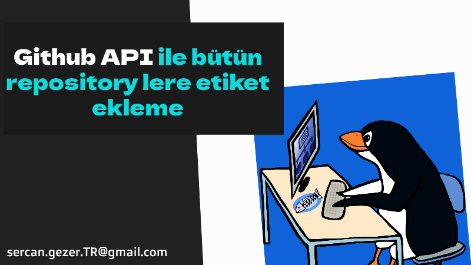

Esenlikler,

Çalıştığımız bir proje ve buna bağlı repolarındaki bütün etiketleri silip, sadece bizim eklemek istediğimiz etiketleri ekleme gibi bir ihtayacımız oluşmuştu. [`Github API`](https://docs.github.com/en/rest) ile bu sorunumuzu python script ile çözdük. 

Belki bir gün başkalarına lazım olur diye buraya bırakıyorum.




### Çalışma Algoritması

* Repoların adlarını çeker
* Repoların etiketlerini listeler
  * Repoların bütün etiketlerini siler
  * Repolarda yeni etiketleri oluşturur


```python
import requests

# Repolar neye aitse onun kullanıcı adını giriyoruz. 'Organizasyon adı' ve ya 'kullanıcı adı'
owner = 'ORGANIZASYON_ADI_VEYA_USERNAME'
# Personal Access Token'ımız
token = 'PERSONAL_ACCESS_TOKEN_GIRINIZ'


# Header ımızı oluşturuyoruz.
headers = {
    'Authorization': f'token {token}',
    'Accept': 'application/vnd.github+json',
    'X-GitHub-Api-Version': '2022-11-28',

}

# Organizasyon ve ya kullanıcıya ait repoları listeliyoruz.
repos_url = f'https://api.github.com/orgs/{owner}/repos'  # Organizasyon için
#repos_url = f'https://api.github.com/users/{owner}/repos'  # Kullanıcı için

response = requests.get(repos_url, headers=headers)


if response.status_code == 200:
    repositories = response.json()
    for repo in repositories:
        repo_name = repo['name']

        # Repository lerimizdeki etiketleri çekiyoruz.
        response = requests.get(f'https://api.github.com/repos/{owner}/{repo_name}/labels', headers=headers)

        if response.status_code == 200:
            labels = response.json()

            # Repodaki bütün etiketleri siliyoruz
            for label in labels:
                label_name = label['name']
                response = requests.delete(f'https://api.github.com/repos/{owner}/{repo_name}/labels/{label_name}', headers=headers)

                if response.status_code == 204:
                    print(f"Deleted label: {label_name}")
                else:
                    print(f"Failed to delete label: {label_name}")
        else:
            print("Failed to list labels")


        #  Oluşturulacak etiketlerin bilgilerini giriyoruz.
        labels_to_create = [
            {"name": "in review", "color": "01DFDE", "description": "Gözden Geçirilecek"},
            {"name": "postponed", "color": "D543F1", "description": "Ertelenen İşler"},
            {"name": "sprint", "color": "FBCA04", "description": "Sprint içerisindeki konular"},
        ]

        # API endpoint imiz
        url = f'https://api.github.com/repos/{owner}/{repo_name}/labels'

        # Etiket oluşturuyoruz.
        for label_data in labels_to_create:
            print(label_data)
            response = requests.post(url, json=label_data, headers=headers)

            # Oluşturduysa ekrana bilgi basar
            if response.status_code == 201:
                print(f"Label '{label_name}' created successfully.")
            else:
                print(f"Failed to create label. Status code: {response.status_code}")
                print(response.text)
else:
    print(f"Failed to retrieve repositories. Status code: {response.status_code}")

```

* Şöyle bir çıktıyla karşılacaksınız.

```bash
.
.
Deleted label: bug
Deleted label: documentation
Deleted label: duplicate
Deleted label: enhancement
Deleted label: good first issue
Deleted label: help wanted
Deleted label: invalid
Deleted label: question
Deleted label: wontfix
Label 'in review' created successfully.
Label 'postponed' created successfully.
Label 'sprint' created successfully.
.
.
```

Esen kalın ...