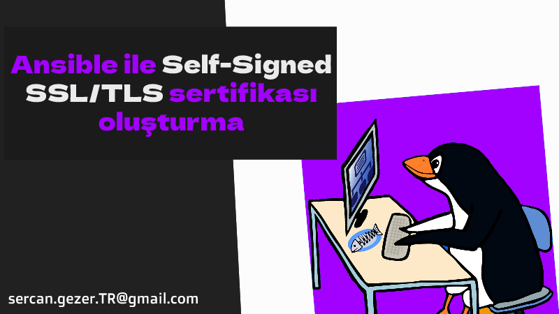

Esenlikler,

Develop ortamlarda SSL ihtiyacımız olduğu zaman `openssl` ile makinelerimize kurup geçiyoruz. Fakat onlarca, yüzlerce makineniz varsa bu `ansible-playbook` tam size göre..

* Öncelikle  `ansible-playbook` çalıştıracağımız makineye gerekli modülü yükleyelim.

```bash
ansible-galaxy collection install community.crypto
```

* Aşağıdaki taskları kendinize göre düzenleyip bütün makinelere basabilirsiniz.

```yaml
- name: 'Self-signed key oluşturuyoruz'
      community.crypto.openssl_privatekey:
        path: "/home/sercangezer/ssl/sercangezer.key" # private keyinizin tam yolu
        size: 4096
        mode: 0600
        type: RSA
        state: present

    - name: 'Self-signed sertifika için Certificate signing request (CSR) oluşturuyoruz.'
      community.crypto.openssl_csr_pipe:
        privatekey_path: "/home/sercangezer/ssl/sercangezer.key" # private keyinizin tam yolu
        common_name: "develop.sercangezer.com.tr"  # domain adresi
        organization_name: "develop.sercangezer.com.tr" # domain adresi
        subject_alt_name: 'DNS:develop.sercangezer.com.tr' # domain adresi
      register: csr

    - name: '10 yıl geçerli SSL/TLS oluşturuyoruz.'
      community.crypto.x509_certificate:
        path: "/home/sercangezer/ssl/sercangezer.crt" # public keyinizin tam yolu
        privatekey_path: "/home/sercangezer/ssl/sercangezer.key" # private keyinizin tam yolu
        csr_content: "{{ csr.csr }}"
        provider: selfsigned
        selfsigned_not_after: "+3650d" # 10 yıllık key oluşturuyoruz
        mode: 0644
```

Esen kalın ...