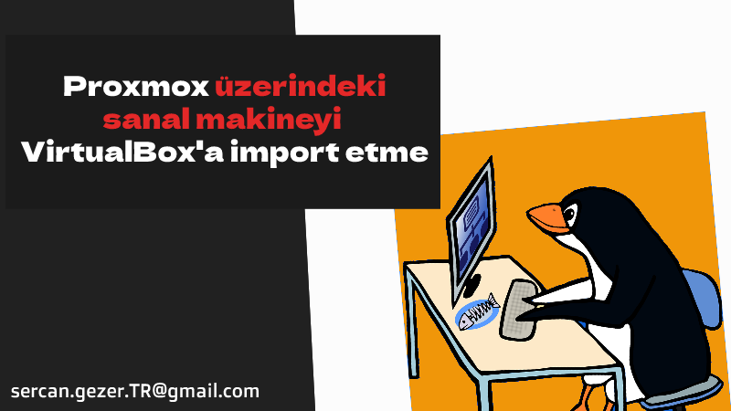

Esenlikler,

[`Proxmox`](https://www.proxmox.com) sanallaştırma ortamında bulunan sanal makinemizi kendi bilgisayarımıza alma ihtiyacı doğmuştu. Tekrar lazım olacağına düşünerek buraya not düşmek istediğim.

O zaman başlayalım.



* Export alacağımız hangi Proxmox fiziksel makinedeyse SSH ile bağlanıyoruz.

* Sonraki işlemlerde kullanacağımız `VMID` imizi bulalım.

```bash
root@proxmox-c1:~# qm list

# output
VMID NAME                         STATUS     MEM(MB)    BOOTDISK(GPID       
100  sercangezer-k8s              running    32000      100.1363405   
102  sercangezer-compose          running    65536      150.55836     
103  sercangezer-Nexus            running    12288      400.692963   
```

* `103` numaralı `sercangezer-Nexus` makinesinin export unu alacağım. Config ine kontrol edelim.

```bash
root@proxmox-c1:~# qm config 103

# output
boot: order=scsi0
cores: 2
ide2: none,media=cdrom
memory: 12288
meta: creation-qemu=7.1.0,ctime=1698403327
name: sercangezer-nexus
net0: virtio=D6:65:2A:74:5A:1E,bridge=vmbr0
numa: 0
ostype: l26
scsi0: local-lvm:vm-103-disk-0,iothread=1,size=400G
scsihw: virtio-scsi-single
smbios1: uuid=186b27f3-4318-481d-beca-438c6e048648
sockets: 2
vmgenid: faedaee9-1326-43be-9e05-cb08b1d9ddfe
```

* Proxmox üzerinde her bir makine bir `logical volume`. Bu sebeple `103` numaralı makinenin logical volume nu bulalım.

```bash
root@proxmox-c1:~# lvs | grep -i 103

#Output
LV            VG  Attr       LSize    Pool Origin Data%  Meta%  Move Log Cpy%Sync Convert                                 
vm-103-disk-0 pve Vwi-aotz--  400.00g data        11.26 
```

* `vm-103-disk-0` bilgisini kullanarak logical volume özelliklerine bakalım.

```bash
root@proxmox-c1:~# lvdisplay /dev/pve/vm-103-disk-0 
  
#OUTPUT  
--- Logical volume ---
LV Path                /dev/pve/vm-103-disk-0
LV Name                vm-103-disk-0
VG Name                pve
LV UUID                RHXaHM-c0Ra-zW6L-0u0m-Ao2p-PFh8-4EaeN9
LV Write Access        read/write
LV Creation host, time nexus, 2023-10-27 13:42:43 +0300
LV Pool name           data
LV Status              available
# open                 1
LV Size                400.00 GiB
Mapped size            11.26%
Current LE             102400
Segments               1
Allocation             inherit
Read ahead sectors     auto
- currently set to     256
Block device           253:9
```

* makinemiz çalışıyorsa durduralım

```bash
qm shutdown 103
```

* Export edelim




```bash
qemu-img convert -O vdi /dev/pve/vm-103-disk-0 /root/sercangezer-nexus.vdi
```

* /root altından dosyayı alıp VirtualBox üzerinde import edebilirsiniz.

Esen kalın ...