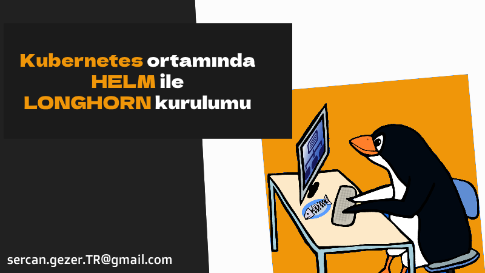
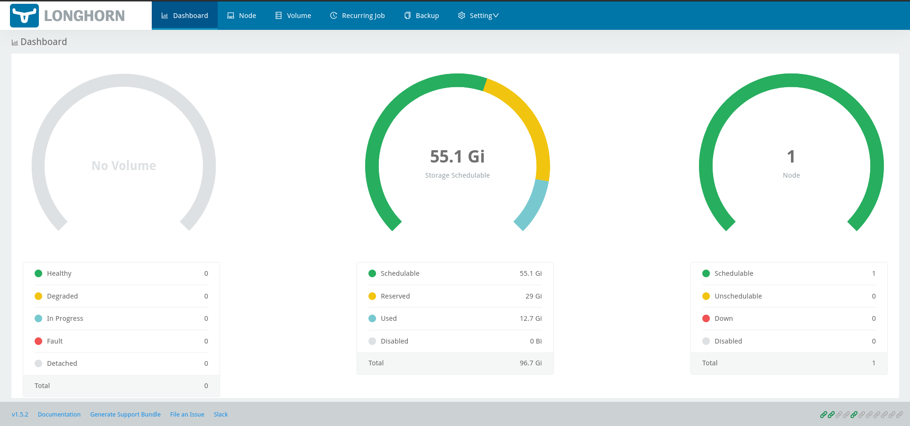

Esenlikler,

### Longhorn nedir?

Longhorn, Rancher firması tarafından Kubernetes için geliştirilmiş dağınık (distributed) block storage sistemidir.

Backup, Restore ve Storage HA sağlayabilmek için projelerimizde kullanıyoruz.

### Longhorn Kurulum




* Helm repo ekleyelim ve güncelleyelim.

```bash
helm repo add longhorn https://charts.longhorn.io
helm repo update
```

* Helm 3 ile Longhorn kuralım

```bash
kubectl create namespace longhorn-system
helm install longhorn longhorn/longhorn --namespace longhorn-system
```

* default storageclass olarak `longhorn` storageclass ayarlayalım. Daha doğrusu 2  tane default storageclass oluyor `local-path` storageclass varsayılanı kaldırıyoruz.

```bash
kubectl patch storageclass local-path -p '{"metadata": {"annotations":{"storageclass.kubernetes.io/is-default-class":"false"}}}'
```

* Çıktısı aşağıdaki gibidir
 
```bash
$ k get storageclasses.storage.k8s.io 

#Çıktısı
NAME                   PROVISIONER             RECLAIMPOLICY   VOLUMEBINDINGMODE      ALLOWVOLUMEEXPANSION   AGE
local-path (default)   rancher.io/local-path   Delete          WaitForFirstConsumer   false                  105d
retained-storage       rancher.io/local-path   Retain          WaitForFirstConsumer   false                  105d
longhorn (default)     driver.longhorn.io      Delete          Immediate              true                   106s

$ kubectl patch storageclass local-path -p '{"metadata": {"annotations":{"storageclass.kubernetes.io/is-default-class":"false"}}}'

#Çıktısı
storageclass.storage.k8s.io/local-path patched


$ k get storageclasses.storage.k8s.io 

#Çıktısı
NAME                 PROVISIONER             RECLAIMPOLICY   VOLUMEBINDINGMODE      ALLOWVOLUMEEXPANSION   AGE
retained-storage     rancher.io/local-path   Retain          WaitForFirstConsumer   false                  105d
longhorn (default)   driver.longhorn.io      Delete          Immediate              true                   2m11s
local-path           rancher.io/local-path   Delete          WaitForFirstConsumer   false                  105d
```

* `nodePort 31999` ayarlayalım.

```bash
kubectl --namespace longhorn-system patch svc longhorn-frontend --type='json' -p '[{"op":"replace","path":"/spec/type","value":"NodePort"},{"op":"replace","path":"/spec/ports/0/nodePort","value":31999}]'
``` 

* `http://SUNUCU_IP:31999` ile Longhorn dashboard a ulaşabilirsiniz.




# Longhorn Kaldırma

```bash
kubectl -n longhorn-system patch -p '{"value": "true"}' --type=merge lhs deleting-confirmation-flag
helm uninstall longhorn -n longhorn-system
kubectl delete namespace longhorn-system
```