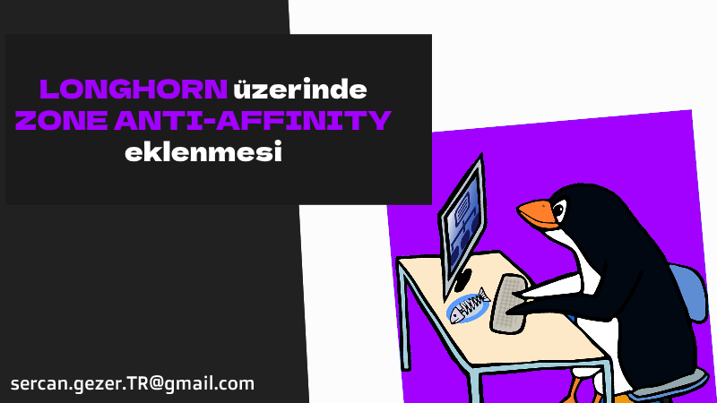
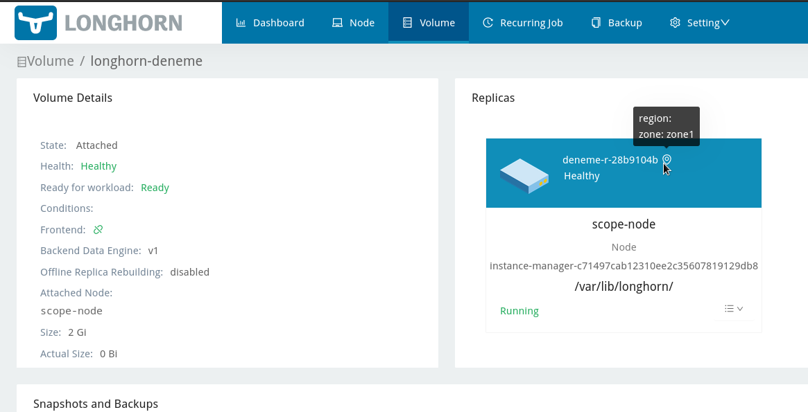

Esenlikler,

# Longhorn Zone Anti-Affinity nedir?

Longhorn kullanan projelerde Storage HA sağlamak için master ve worker node lara `label ekleyerek` storage tarafında High Avaliability sağlıyoruz.

```bash
Örnek Senaryo: 3 master 6 worker olan bir cluster yapımızda 1 master 2 worker şeklinde zone oluşturup, Longhornda volume leri her zone da farklı makinelerde çalışmasını sağlayacağız.

# Zone1
master-01
worker-01
worker-02

# Zone2
master-02
worker-03
worker-04

# Zone3
master-03
worker-05
worker-06
```


# Konfigürasyon yapılması




* Node larımıza label ekliyoruz.

Örnek söz dizimi (Syntax);

```bash
kubectl label nodes <NODE_NAME> topology.kubernetes.io/zone=<ZONE_NAME>
```

* Bizim seneryomuza göre;

```bash
kubectl label nodes master-01 topology.kubernetes.io/zone=zone1
kubectl label nodes worker-01 topology.kubernetes.io/zone=zone1
kubectl label nodes worker-02 topology.kubernetes.io/zone=zone1
kubectl label nodes master-02 topology.kubernetes.io/zone=zone2
kubectl label nodes worker-03 topology.kubernetes.io/zone=zone2
kubectl label nodes worker-04 topology.kubernetes.io/zone=zone2
kubectl label nodes master-03 topology.kubernetes.io/zone=zone3
kubectl label nodes worker-05 topology.kubernetes.io/zone=zone3
kubectl label nodes worker-06 topology.kubernetes.io/zone=zone3
```

* Longhorn dashboard a girip aşağıdaki ayarları set ediyoruz.

```bash
Replica Node Level Soft Anti-Affinity: TRUE (tikle)
Replica Zone Level Soft Anti-Affinity: TRUE (tikle)
```

* Direkt olarak Kubernetes üzerinden `true` set edebilirsiniz.

```bash
# Replica Node Level Soft Anti-Affinity: TRUE
kubectl --namespace longhorn-system patch settings.longhorn.io replica-soft-anti-affinity --type='json' -p '[{"op":"replace","path":"/value","value":"true"}]'


# Replica Zone Level Soft Anti-Affinity: TRUE
kubectl --namespace longhorn-system patch settings.longhorn.io replica-zone-soft-anti-affinity --type='json' -p '[{"op":"replace","path":"/value","value":"true"}]'
```

* Longhorn Dashboard > Volumes üzerinden artık hangi PVC'nin hangi zone da oluştuğunu görebilirsiniz.

