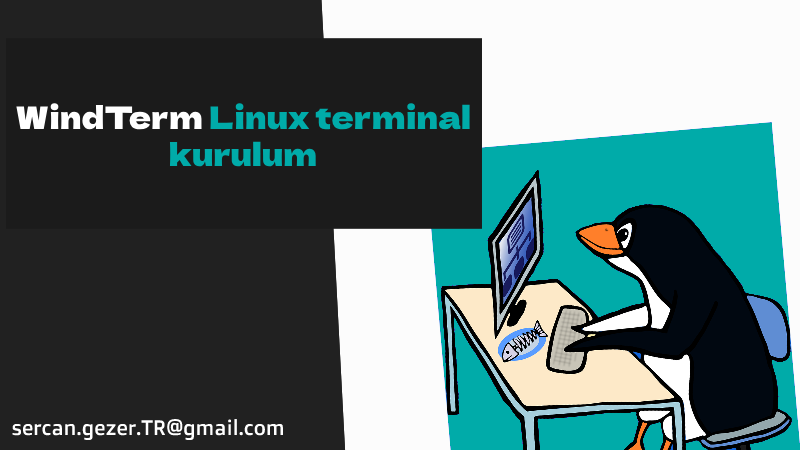

Esenlikler,

Windows ortamında terminal olarak [`MobaXterm`](https://mobaxterm.mobatek.net/) ve [`SecureCRT`](https://www.vandyke.com/products/securecrt/) kullananlar, Linux desktop ortamına geçtiğinde bu yazılımların sağlamış olduğu fonksiyoniteyi sağlayan bir uygulamayı bulamıyor.

Tam bu ihtayaç ortamında 2 ürünün güzel yanlarının bir uygulamada toplanmış hali open-source [`Windterm`](https://github.com/kingToolbox/WindTerm) !!

Kullanınca müptelası olacaksınız ..

O zaman kuruluma geçelim.

# Windterm Kurulum

* Github sayfasından son sürüm kaynak dosyasını indirelim.

```bash
VER=$( curl --silent "https://api.github.com/repos/kingToolbox/WindTerm/releases/latest"| grep '"tag_name"'|sed -E 's/.*"([^"]+)".*/\1/')
wget https://github.com/kingToolbox/WindTerm/releases/download/${VER}/WindTerm_${VER}_Linux_Portable_x86_64.tar.gz
```

* İndirdiğimiz(WindTerm_2.5.0_Linux_Portable_x86_64.tar.gz) tar dosyasını açalım.

```bash
tar -xvf WindTerm_2.5.0_Linux_Portable_x86_64.tar.gz
```

* Klasörü `/opt` altına taşıyalım.

```bash
sudo mv WindTerm_2.5.0 /opt/WindTerm
```

* Klasörün yetkilerini düzenleyelim.

```bash
sudo chmod -R 775 /opt/WindTerm
```

* Windterm kısayolu oluşturalım.

```bash
cat << EOF | sudo tee /usr/share/applications/windterm.desktop
[Desktop Entry]
Name=WindTerm
Comment=A professional cross-platform SSH/Sftp/Shell/Telnet/Serial terminal
GenericName=Connect Client
Exec=/opt/WindTerm/WindTerm
Type=Application
Icon=/opt/WindTerm/windterm.png
StartupNotify=false
StartupWMClass=Code
Categories=Application;Development
Actions=new-empty-window
Keywords=windterm

[Desktop Action new-empty-window]
Name=New Empty Window
Icon=/opt/WindTerm/windterm.png
Exec=/opt/WindTerm/WindTerm
EOF
```

* Artık kullanmaya başlayabilirsiniz..

Esen kalın ...