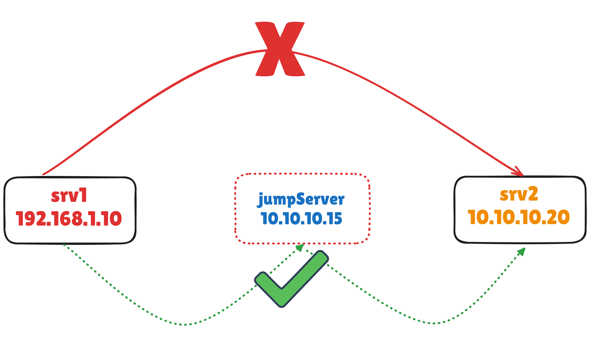

Esenlikler,



Genellikle büyük organizasyonlarda güvenliği sağlamak için her sunucuya bağlanan bir `terminal/gateway/jumpserver` vardır. Önce bu sunucuya bağlanıp daha sonra bağlanmak istediğimiz sunucuya SSH atarız.

Bu iş yükünden kurtulmak için `SSH` ve `SCP` nin kendi parametrelerini kullanabiliriz.

## SSH bağlantısı için JumpServer kullanmak;

```bash

ssh -A -J JUMPSERVER_USER@JUMPSERVER_IP HEDEF_KULLANICI@HEDEF_IP

# Örnek
ssh -A -J sercangezer@192.168.1.10 sercangezer@10.10.10.20
```

* `-A`.: SSH bağlantısı üzerinden kimlik doğrulaması için `Agent Forwarding` özelliğini etkinleştirir. Bu özellik, ilk bağlantıda kullanılan kimlik doğrulama anahtarının ikinci bağlantıya iletilmesini sağlar. Böylece, ara sunucuya erişirken yerel anahtarları kullanmaya devam edebilirsiniz.

* `-J sercangezer@192.168.1.10`: Bu parametre, "Jump Host" veya "ProxyJump" olarak bilinir. İlk olarak, `sercangezer@192.168.1.10` adresine bağlanır ve bu sunucu üzerinden ikinci hedef olan `sercangezer@10.10.10.20` sunucusuna geçiş yapar. Yani, doğrudan 10.10.10.20 adresine erişiminiz yoksa veya erişim sınırlıysa, 192.168.1.10 üzerinden geçerek erişimi mümkün kılar.


## SCP bağlantısı için JumpServer kullanmak;

### Uzak sunucuya dosya kopyalamak için
```bash
scp -o ProxyJump=sercangezer@192.168.1.10 local_dosya sercangezer@10.10.10.20:~
```

* `scp`: Güvenli dosya kopyalama komutudur. SSH protokolünü kullanarak dosyaları yerel sistem ile uzak sistem arasında kopyalar.
* `-o ProxyJump=sercangezer@192.168.1.10`: Bu parametre, 192.168.1.10 IP adresindeki sunucuyu proxy olarak kullanır. İlk önce bu sunucuya bağlanır, ardından ikinci sunucuya geçiş yapar. sercangezer kullanıcı adıyla ilk sunucuya bağlanılacaktır.
* `local_dosya`: Kopyalanmak istenen yerel dosyanın adıdır.
* `sercangezer@10.10.10.20:~`: Dosyanın kopyalanacağı uzak sunucunun bilgilerini içerir. Burada sercangezer kullanıcı adı ile 10.10.10.20 IP adresindeki sunucuda kullanıcının ana dizinine (~) kopyalanacaktır.

### Uzak sunucudan kendi sunucunuza dosya kopyalamak için
```bash
scp -o ProxyJump=sercangezer@192.168.1.10 sercangezer@10.10.10.20:uzak_dosya_yolu yerel_yol
```

* `scp`: Güvenli dosya kopyalama komutudur.
* `-o ProxyJump=sercangezer@192.168.1.10`: Bu parametre, dosya kopyalama işlemini yaparken 192.168.1.10 IP adresindeki sunucuyu proxy olarak kullanır.
* `sercangezer@10.10.10.20:uzak_dosya_yolu`: Kopyalanacak dosyanın uzak sunucudaki konumunu gösterir. sercangezer kullanıcı adı ile 10.10.10.20 sunucusuna erişilir ve uzak_dosya_yolu adlı dosya kopyalanır.
* `yerel_yol`: Uzak dosyanın kopyalanacağı yerel sistemdeki hedef yolu belirtir.

Esen kalın ...